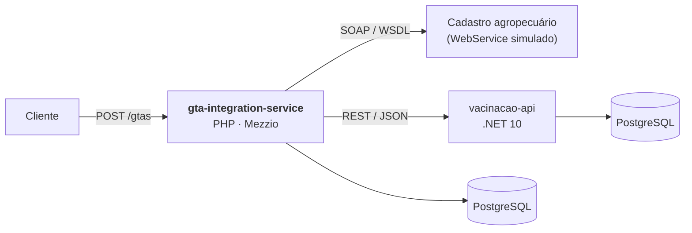
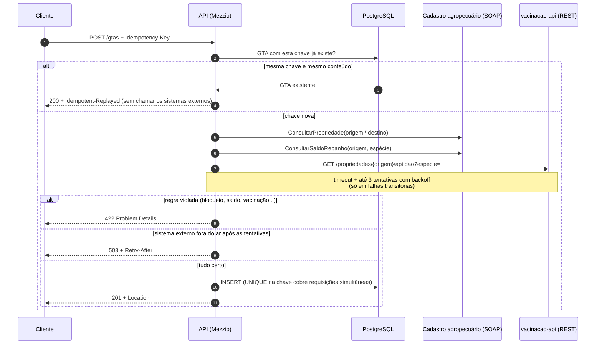

# gta-integration-service

[](https://github.com/wescaxeta/gta-integration-service/actions/workflows/ci.yml)


[](LICENSE)

API REST para emissão de **GTA (Guia de Trânsito Animal)**, o documento obrigatório para
transportar animais entre propriedades rurais. Antes de emitir, a API consulta **dois sistemas
externos**:

- um **WebService SOAP** de cadastro agropecuário (a propriedade existe? está ativa? tem saldo de animais?);
- a **[vacinacao-api](https://github.com/wescaxeta/vacinacao-api)**, uma API REST em **.NET**
  (o rebanho está com as vacinas obrigatórias em dia?).



O projeto foca no que dá trabalho em integração entre sistemas: **contratos SOAP e REST,
timeout, retry com backoff, idempotência, tradução de erros e testes sem depender da rede**.
O domínio vem da minha experiência com sistemas de defesa agropecuária usados em 9 estados.
Todo o código e todos os dados aqui são fictícios.

---

## Como funciona a emissão



## Destaques técnicos

| O quê | Onde | Por quê |
|---|---|---|
| **Camada anticorrupção** | [`SoapCadastroAgropecuario`](src/Integration/Soap/SoapCadastroAgropecuario.php) | O domínio depende de uma interface própria. O adaptador traduz o contrato SOAP e valida cada campo da resposta ([ADR 0002](docs/adr/0002-camada-anticorrupcao-soap.md)). |
| **Integração REST com outro sistema (.NET)** | [`RestAptidaoSanitaria`](src/Integration/Rest/RestAptidaoSanitaria.php) | Cliente Guzzle com timeout, retry em erro de rede e 5xx, sem retry em 4xx, e validação do JSON recebido ([ADR 0004](docs/adr/0004-integracao-rest-vacinacao.md)). |
| **Retry com backoff exponencial** | [`RetryPolicy`](src/Integration/Retry/RetryPolicy.php) | A mesma política serve às duas integrações: repete só falhas transitórias, nunca erros do cliente. |
| **Idempotency-Key** | [`EmitirGta`](src/Application/EmitirGta.php) | Reenviar após um 503 ou uma queda de conexão não duplica a GTA. A constraint `UNIQUE` cobre a corrida entre requisições ([ADR 0003](docs/adr/0003-idempotencia.md)). |
| **Problem Details (RFC 9457)** | [`ErrosDeDominioMiddleware`](src/Http/Middleware/ErrosDeDominioMiddleware.php) | Erros padronizados com `type`, `status` e `detail`, mais erros por campo na validação ([catálogo](docs/erros.md)). |
| **Testes de integração sem rede** | [`SoapClientEmProcesso`](tests/Double/SoapClientEmProcesso.php), [`RestAptidaoSanitariaTest`](tests/Integration/RestAptidaoSanitariaTest.php) | SOAP: o `SoapClient` entrega o XML a um `SoapServer` no mesmo processo. REST: o `MockHandler` do Guzzle simula 200, 4xx, 503 e queda de conexão. |
| **WebService simulado** | [`soap-mock/`](soap-mock/src/CadastroAgropecuarioMock.php) | Um container próprio, com WSDL document/literal e um código que simula o serviço fora do ar. |
| **Integridade no banco** | [`schema.sql`](database/schema.sql) | `CHECK` constraints repetem as invariantes do domínio. Mesmo um bug na aplicação não grava GTA inválida. |
| **Logs estruturados** | [`LoggerFactory`](src/Infrastructure/Factory/LoggerFactory.php) | JSON no stderr, com operação, tentativas e duração de cada chamada SOAP. |
| **PHP 8.4 moderno** | [`Gta`](src/Domain/Gta.php) | Visibilidade assimétrica (`public private(set)`), `readonly` classes, enums, constantes tipadas e UUID v7. |

## Como rodar

Requisitos: Docker e Make.

```bash
git clone https://github.com/wescaxeta/gta-integration-service.git
cd gta-integration-service
make up      # API em :8080, mock SOAP em :8081, vacinacao-api (.NET) em :8090, PostgreSQL em :5432
make smoke   # teste de ponta a ponta contra a API no ar
make test    # todos os testes, inclusive os de PostgreSQL
make help    # lista todos os comandos
```

Teste manualmente com [`requests.http`](requests.http) (VS Code REST Client ou PhpStorm), ou com curl:

```bash
curl -i -X POST http://localhost:8080/gtas \
  -H 'Content-Type: application/json' \
  -H 'Idempotency-Key: meu-pedido-0001' \
  -d '{"origem":"GO000001","destino":"GO000002","especie":"bovino","quantidade":50,"finalidade":"abate"}'
```

O Compose também sobe a `vacinacao-api`, construída direto do
[repositório dela no GitHub](https://github.com/wescaxeta/vacinacao-api), com seu próprio banco.

### Dados de demonstração

| Código | Propriedade | Cadastro (SOAP) | Vacinação (.NET) | Use para testar |
|---|---|---|---|---|
| `GO000001` | Fazenda Boa Vista | ATIVA · 500 bovinos | em dia | emissão com sucesso |
| `GO000002` | Frigorífico Central | ATIVA | — | destino válido |
| `GO000003` | Sítio Santa Luzia | BLOQUEADA · 80 bovinos | brucelose vencida | origem impedida no cadastro (422) |
| `GO000004` | Fazenda Desativada | INATIVA | — | destino impedido (422) |
| `GO000005` | Fazenda Vista Alegre | ATIVA · 300 bovinos | **sem brucelose** | **barrada pela API de vacinação (422)** |
| `MT000010` | Fazenda Pantanal | ATIVA · 1.200 bovinos | em dia (raiva no prazo) | transporte interestadual |
| `GO999999` | — | fora do ar | — | **serviço fora do ar** (503 após 3 tentativas) |

## Endpoints

| Método | Rota | Descrição |
|---|---|---|
| `GET` | `/health` | Health check |
| `POST` | `/gtas` | Emite uma GTA (exige `Idempotency-Key`) |
| `GET` | `/gtas/{id}` | Consulta uma GTA |
| `POST` | `/gtas/{id}/cancelamento` | Cancela uma GTA dentro da validade |

Contrato completo em [`docs/openapi.yaml`](docs/openapi.yaml). O WSDL do serviço externo está
em [`resources/wsdl/`](resources/wsdl/cadastro-agropecuario.wsdl).

## Arquitetura

```
src/
├── Domain/          # Regras de negócio puras: Gta, CodigoPropriedade, enums, exceções e portas
├── Application/     # Casos de uso: EmitirGta, CancelarGta
├── Integration/     # Adaptador SOAP (camada anticorrupção) e política de retry
├── Infrastructure/  # PostgreSQL (PDO), relógio, logger e factories do container
└── Http/            # Handlers PSR-15, validação de entrada e tradução de erros
soap-mock/           # WebService SOAP simulado (container próprio)
resources/wsdl/      # Contrato do WebService
database/            # Schema SQL com constraints
docs/                # ADRs, OpenAPI e catálogo de erros
tests/
├── Unit/            # Domínio, casos de uso e retry, com dublês em memória
├── Integration/     # SOAP real em processo + a aplicação Mezzio inteira via HTTP em memória
└── Database/        # Repositório contra PostgreSQL real
```

As dependências apontam para dentro: `Http` → `Application` → `Domain` ← `Integration` / `Infrastructure`.
O domínio não conhece HTTP, SOAP nem SQL.

## Qualidade

- **PHPUnit 13**, com três suítes: unitária, integração (SOAP, REST e HTTP) e banco (PostgreSQL)
- **PHPStan nível max** com strict rules, sem baseline
- **PHP-CS-Fixer** no padrão PER-CS 2.0
- **CI no GitHub Actions** em três jobs (qualidade, testes com PostgreSQL e cobertura, ponta a ponta com Docker Compose),
  além de um pipeline equivalente no **GitLab CI** ([`.gitlab-ci.yml`](.gitlab-ci.yml))

## Decisões de arquitetura (ADRs)

1. [Mezzio (Laminas) em vez de Laravel](docs/adr/0001-mezzio-em-vez-de-laravel.md)
2. [Camada anticorrupção para o WebService SOAP](docs/adr/0002-camada-anticorrupcao-soap.md)
3. [Idempotência na emissão de GTA](docs/adr/0003-idempotencia.md)
4. [Integração REST com a API de vacinação (.NET)](docs/adr/0004-integracao-rest-vacinacao.md)

## Roadmap

- [x] Consultar a vacinação do rebanho antes de emitir a GTA ([vacinacao-api](https://github.com/wescaxeta/vacinacao-api))
- [ ] Circuit breaker: parar de chamar os sistemas externos por um tempo após falhas seguidas
- [ ] Emissão assíncrona com fila (Redis) e notificação por webhook
- [ ] Outbox pattern para publicar o evento "GTA emitida" para outros sistemas
- [ ] Listagem paginada de GTAs por propriedade
- [ ] Autenticação (API key ou OAuth2 client credentials)

## Licença

[MIT](LICENSE)
